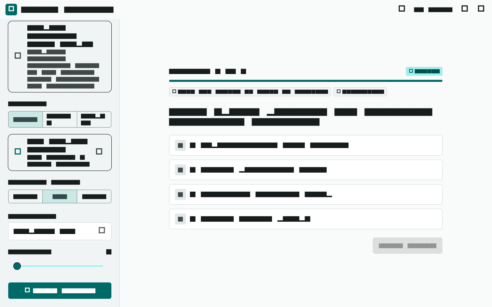
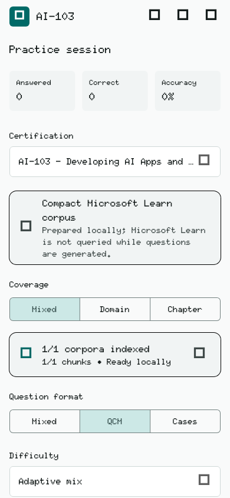
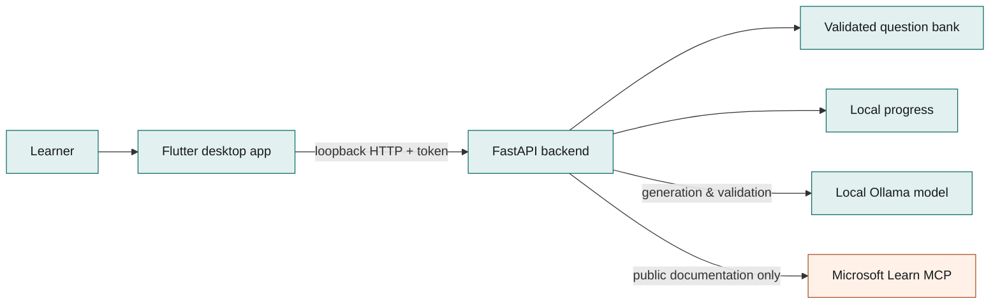

<p align="center">
  
</p>

<h1 align="center">Quiz Machine Local</h1>

<p align="center">
  <strong>Turn trusted learning material into focused quizzes — locally.</strong>
</p>

<p align="center">
  A local-first desktop study app powered by Flutter, FastAPI, Ollama and
  Microsoft Learn.
</p>

<p align="center">
  <a href="https://github.com/Sidox-ops/quiz-machine-local/actions/workflows/ci.yml"></a>
  <a href="https://github.com/Sidox-ops/quiz-machine-local/actions/workflows/security.yml"></a>
  <a href="LICENSE"></a>
  
  
</p>

> **Public alpha:** the local-first architecture and core quiz pipeline are
> tested, while signed desktop distribution and the broader model compatibility
> matrix are still being expanded. See [known limitations](docs/COMPATIBILITY.md).

Quiz Machine Local is an open-source desktop study application for Microsoft
AI certifications. It turns certification-scoped learning material into
validated practice sessions using a model that already runs on your computer.

The application currently supports AI-901, AI-103, and AI-200. It requires no
account and includes no advertising, analytics, or publisher-operated backend.
Imported corpora, generated questions, answers, and learning progress remain on
the user's computer in the supported configuration.

Quiz Machine is an independent educational tool. It is not affiliated with,
endorsed by, sponsored by, or an official product of Microsoft or any
certification provider. It does not contain official exam questions and cannot
guarantee an exam result.

## Why local?

| Local model | Prepared sessions | Explicit boundaries |
| :--- | :--- | :--- |
| Use a compatible Ollama model already installed on the machine. Nothing is downloaded silently. | Questions are generated, checked and stored before revision starts. No waiting on the model after each answer. | Learner answers, scores, imported corpora and progress remain local in the supported configuration. |

## Product preview

<p align="center">
  
  
</p>

<p align="center"><sub>Desktop quiz workspace and responsive onboarding.</sub></p>

## What it does

- retrieves the current measured skills and supporting pages from the public
  Microsoft Learn MCP service;
- persists one certification-scoped canonical corpus locally;
- builds a small evidence packet for one learning objective at a time;
- generates, validates, fingerprints, and explains questions with Ollama;
- reuses a validated local question bank before generating missing questions;
- completes the entire batch before revision, so answering never waits for an
  LLM call;
- tracks mastery, streaks, response time, coverage, and recurring confusions by
  certification objective;
- imports strictly structured, certification-scoped Markdown supplied by the
  user.

Question generation, factual validation, and explanation are separate model
calls. Stable `opt_*` identifiers are the correctness keys; A-D labels are
derived only from presentation order. The canonical question is frozen before
its explanation is generated, and the final artifact is checked again before
display and scoring.

## How it fits together



Flutter presents state and user intent. The backend owns retrieval, generation,
validation, correctness and persistence. Ollama stays behind one provider
boundary, and packaged builds expose the backend only on loopback with a random
token. See the full [architecture guide](docs/ARCHITECTURE.md).

## Installation status

There is currently no stable end-user release. Source builds are available now;
signed installers will appear on the
[GitHub Releases page](https://github.com/Sidox-ops/quiz-machine-local/releases)
after the first release candidate passes clean-machine verification. Do not use
binary downloads from third-party mirrors.

## Quick start

### Requirements

- macOS or Windows for the supported desktop experience;
- Python 3.10 or newer;
- Flutter with desktop support;
- Ollama with at least one local text-generation model already installed;
- `curl`.

On first launch, the app inventories the models already available through the
local Ollama API. It excludes embedding-only and cloud-backed entries and
recommends the strongest compatible model estimated to fit the machine's memory
budget. Before saving the selection it runs a small local structured-output
probe. No model is downloaded or replaced by Quiz Machine. The choice can be
changed later from the quiz workspace; `AI103_LLM_MODEL` remains available as a
locked developer or administrator override.

The model probe validates basic JSON-schema support, not educational quality.
Model and platform expectations are documented in
[`docs/COMPATIBILITY.md`](docs/COMPATIBILITY.md).

The legacy offline AI-103 mode additionally requires `nomic-embed-text` by
default. That embedding model must also be installed explicitly before launch.

### Run locally

Check the existing toolchain, prepare the source build and launch the complete
development stack:

```bash
./scripts/doctor.sh
./start.sh
```

The setup script creates `.venv`, installs the pinned Python dependencies when
needed, prepares the Flutter desktop runner, starts the loopback backend, and
launches Flutter. Onboarding then verifies Ollama, lets the user select an
installed generation model, and checks the Microsoft Learn connection. Neither
`start.sh` nor onboarding downloads Ollama models.

<details>
<summary><strong>Run the backend and Flutter separately</strong></summary>

```bash
./run_backend.sh

cd flutter_app
./bootstrap.sh
flutter pub get
flutter run -d macos
```

</details>

<details>
<summary><strong>Windows source build</strong></summary>

Native Windows source builds use PowerShell and the Windows Flutter desktop
toolchain. Generate the runner once from Git Bash, then launch the app:

```powershell
bash .\flutter_app\bootstrap.sh
bash .\run_backend.sh
cd flutter_app
flutter run -d windows
```

The repository currently provides `run_backend.sh`, so Windows contributors may
also start it from Git Bash. A native PowerShell launcher is tracked on the
[roadmap](ROADMAP.md).

</details>

## Data and network boundaries

Runtime state is ignored by Git and stored under `storage/` during development
or in the operating system's application-data directory in packaged builds.
This includes the Microsoft Learn cache, the validated question bank, progress,
indexes, and logs.

By default, the application sends certification and objective search requests
to the public Microsoft Learn MCP endpoint. It does not send imported corpora,
answers, scores, or personal identifiers there. Ollama is called through its
local API at `127.0.0.1`. Pointing Ollama at a remote endpoint changes that
privacy boundary and is the user's responsibility.

Set the following value to use the legacy local AI-103 corpus/index path and
disable Microsoft Learn retrieval:

```dotenv
AI103_KNOWLEDGE_PROVIDER=local
```

The import format and content-rights rules are documented in
[`docs/CORPUS_FORMAT.md`](docs/CORPUS_FORMAT.md) and
[`docs/PUBLISHABLE_CORPUS.md`](docs/PUBLISHABLE_CORPUS.md).

## Verification

Run the smallest complete local checks from the repository root:

```bash
.venv/bin/python -m unittest discover -s tests -v
.venv/bin/python -m compileall -q backend tests build_index.py quiz.py
bash -n setup.sh start.sh run_backend.sh scripts/*.sh

cd flutter_app
flutter analyze
flutter test
```

The tests use fakes for Ollama and Microsoft Learn. They do not download models
or alter a real user corpus. A separate scheduled workflow performs a bounded
live contract check against the public Microsoft Learn MCP endpoint.

## Project map

```text
backend/        local FastAPI API, corpus pipeline, RAG, quiz engine and stores
flutter_app/    Flutter desktop application and widget tests
tests/          Python unit and contract tests
scripts/        diagnostics and release packaging
packaging/      PyInstaller configuration
data/reference/ redistributable demonstration corpus, licensed separately
docs/           corpus, retrieval, contribution and release documentation
```

Generated platform runners, virtual environments, private corpora, runtime
state, builds, releases, and Graphify indexes are intentionally excluded.

## Contributing

Read [`CONTRIBUTING.md`](CONTRIBUTING.md) before opening a pull request. Keep
changes local-first: no hosted account dependency, telemetry, secret, copied
exam content, or unlicensed training material belongs in this repository.
Every change to `main` goes through a pull request, automated checks and owner
review. Contributors can propose freely; repository approval and merge access
remain with the maintainer.

For help and public maintenance expectations, read [`SUPPORT.md`](SUPPORT.md).
Planned work is listed in [`ROADMAP.md`](ROADMAP.md), and release-facing changes
are recorded in [`CHANGELOG.md`](CHANGELOG.md).

## Licence

The application source is licensed under
[GNU AGPL version 3 only](LICENSE), SPDX identifier `AGPL-3.0-only`.

The demonstration corpus under `data/reference/` is offered separately under
CC0 1.0. Doto is distributed under the SIL Open Font License 1.1. Other
dependencies and Ollama models remain subject to their respective licences; see
[`THIRD_PARTY_NOTICES.md`](THIRD_PARTY_NOTICES.md).
